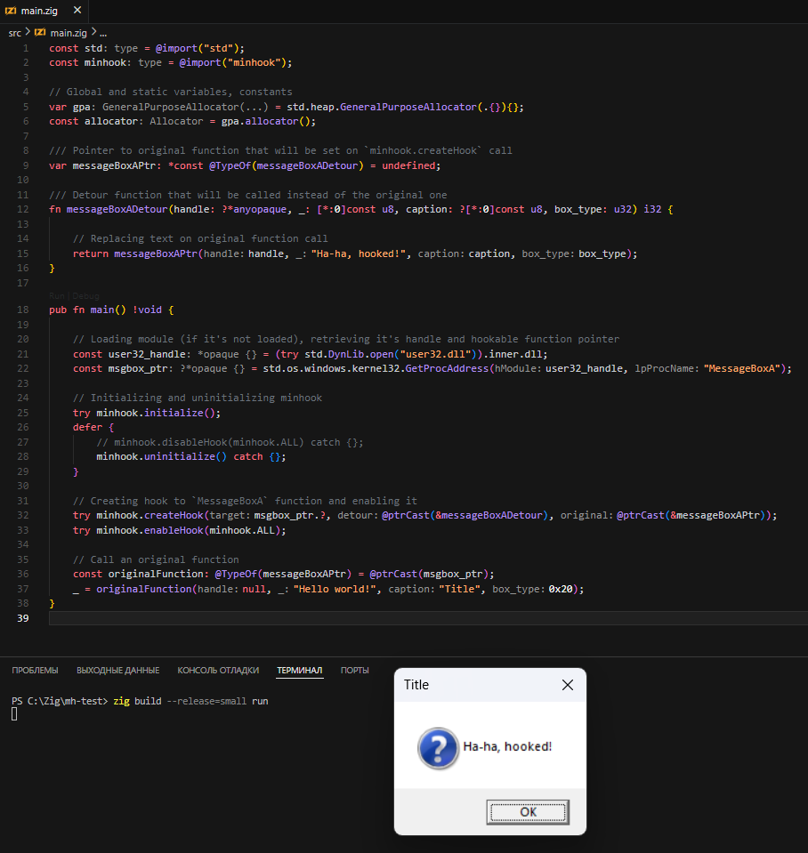

# zig-minhook
The Minimalistic x86/x64 API Hooking Library for Windows

## Details
This library is a wrap for original [MinHook](https://github.com/TsudaKageyu/minhook) library.<br>
It's uses Zig build system to statically-compile source library and uses `MinHook.h` header file to wrap library functions.<br><br>

> [!Important]  
> This library can be built only for `x86_64-windows-gnu` or `x86_windows-gnu`

## Installation
1. Add zig-minhook as a dependency in your `build.zig.zon` file:
```
zig fetch --save git+https://github.com/Xenely14/zig-minhook#main
```
2. In your `build.zig`, add the `minhook` module as a dependency you your program:
```zig
const minhook = b.dependency("minhook", .{});

// Add library import to your executable or library b.addExecutable(...), b.addSharedLibrary(...)
exe_or_lib.root_module.addImport("minhook", minhook.module("minhook"));
```

## Usage
After the installation complete you can use `minhook` dependency in your root file:
```zig
const std = @import("std");
const minhook = @import("minhook");

// Global and static variables, constants
var gpa = std.heap.GeneralPurposeAllocator(.{}){};
const allocator = gpa.allocator();

/// Pointer to original function that will be set on `minhook.createHook` call
var messageBoxAPtr: *const @TypeOf(messageBoxADetour) = undefined;

/// Detour function that will be called instead of the original one
fn messageBoxADetour(handle: ?*anyopaque, _: [*:0]const u8, caption: ?[*:0]const u8, box_type: u32) i32 {

    // Replacing text on original function call
    return messageBoxAPtr(handle, "Ha-ha, hooked!", caption, box_type);
}

pub fn main() !void {

    // Loading module (if it's not loaded), retrieving it's handle and hookable function pointer
    const user32_handle = (try std.DynLib.open("user32.dll")).inner.dll;
    const msgbox_ptr = std.os.windows.kernel32.GetProcAddress(user32_handle, "MessageBoxA");

    // Initializing and uninitializing minhook
    try minhook.initialize();
    defer {
        // minhook.disableHook(minhook.ALL) catch {};
        minhook.uninitialize() catch {};
    }

    // Creating hook to `MessageBoxA` function and enabling it
    try minhook.createHook(msgbox_ptr.?, @ptrCast(&messageBoxADetour), @ptrCast(&messageBoxAPtr));
    try minhook.enableHook(minhook.ALL);

    // Call an original function
    const originalFunction: @TypeOf(messageBoxAPtr) = @ptrCast(msgbox_ptr);
    _ = originalFunction(null, "Hello world!", "Title", 0x20);
}
```

Above example will hook `MessageBoxA` function from `user32.dll` and will replace it's call with your defined function:

